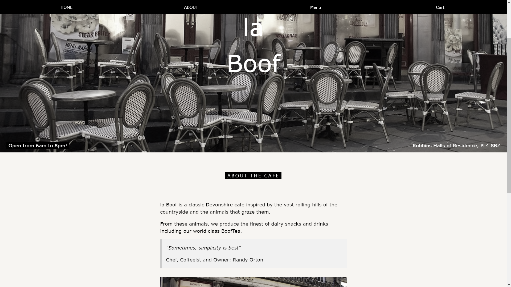
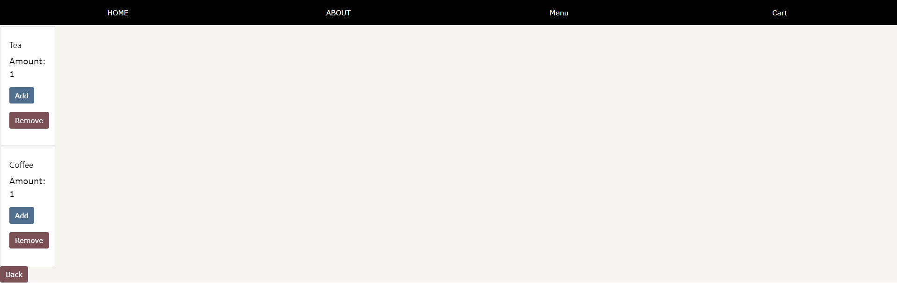

# ISAD251 Coursework Submission
This is my repository for uploading ISAD251 coursework.

## Application Fact Sheet
**Design**
When the application is first come across, the user will land on the home page. This contains an aesthetically pleasing page with a large picture with the café name on the front of it, la Boof, to show off the classical yet surprisingly clean nature of the café. This is further represented by the simplistic, 1940’s era light-sandy background colour, bold stand-out headers and simple paragraph text as seen below in the screenshots. The navigation bar at the top again fits this design with white text on the black background.

In the menu page, it is a simplistic and understandable view with buttons to order drinks or food. Beneath it, the cart count ensures that users know when they’ve made a mistake in their order before even going to the cart. This keeps the speed of entering-to-ordering as low as possible which improves customer satisfaction. The buttons are a dusty blue colour to once again match the style seen below.
The cart page lets customers adjust the quantity of the items they plan on ordered, as well as remove them too. The navigation bar and a back button provide transport, as seen below in screenshots.

**Functionality**
The major feature of the webpage is the ability to automatically display menu items on the screen by filling out a template for each item in the database associated with storing the menu. This massively reduces workload and applies good practice by only having to write the code once, but it also being open for extension and use through adding records into the database.

**Browser Testing**
The style on Chrome was what the website was designed in mind with but despite that will work on multiple other browsers. The Internet Explorer colours and fonts give a bit more of a basic feel to the site, but still portrays the café’s theme well.
All interactable elements such as the menu ordering and navigation bar work identically between the two browsers and were tested using PhpStorm’s built in run buttons.

## Youtube Video
https://youtu.be/wYv7MpUxsvI

## Screenshots

**

## Credits
Credit for the website template: https://www.w3schools.com/

Software used:
JetBrains - PhpStorm
MySQL - MySQL Workbench

Credit for background image on webpage: Cafe Rouge, dusk by byronv2 (https://www.flickr.com/photos/woolamaloo_gazette/)
